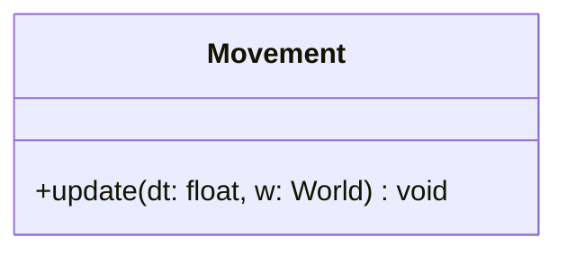

## Movement

The **Movement** system handles the kinematic physics of the game.  
It iterates through entities and updates their coordinates based on their speed and direction vectors, ensuring smooth frame-rate independent movement.

### Dependencies & Integration

This system transforms abstract velocity values into actual spatial displacement.

| Type | Name | Description |
|:---|:---|:---|
| **Component** | [`Position`](../component/Position.md) | The component being updated. Represents the current location in the world. |
| **Component** | [`Velocity`](../component/Velocity.md) | The source data defining speed (pixels/second) and direction (X/Y). |

---

### Public Methods

| Method | Signature | Description |
|:------|:----------|:------------|
| **Update** | `void update(const float& dt, World &w) override;` | Calculates the new position for every entity possessing both Position and Velocity components. |

---

