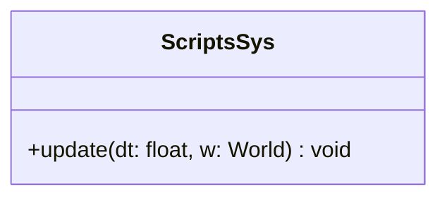

## ScriptsSys

The **ScriptsSys** system is the execution engine for custom entity behaviors.  
It iterates through all entities possessing a [`Script`](../component/Script.md) component and executes the function stored within them. This allows for flexible, entity-specific logic (like AI, input handling, or specific event triggers) without hardcoding it into the core engine.

### Dependencies & Integration

This system turns static data (function pointers) into active logic.

| Type | Name | Description |
|:---|:---|:---|
| **Component** | [`Script`](../component/Script.md) | Holds the `std::function` to be executed. |
| **Context** | `World` | Passed to the script function so it can manipulate other entities or components. |

---

### Public Methods

| Method | Signature | Description |
|:------|:----------|:------------|
| **Update** | `void update(const float& dt, World &w) override;` | Loops through entities with scripts and invokes their stored function. |

---

