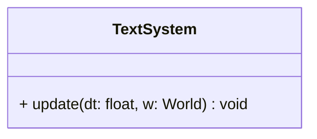

## TextSys

The **TextSystem** is responsible for synchronizing the state of text entities.  
It updates the internal SFML `Text` object stored in the [`Text`](../component/Text.md) component to match the entity's logical **Position** and **Rotation** components, ensuring visual consistency before rendering.

### Dependencies & Integration

This system bridges the gap between abstract logical coordinates and the concrete SFML Text object.

| Type | Name | Description |
|:---|:---|:---|
| **Component** | [`Text`](../component/Text.md) | The target component containing the SFML Text object to be updated. |
| **Component** | [`Position`](../component/Position.md) | Used to set the absolute position of the text on screen. |
| **Component** | [`Rotation`](../component/Rotation.md) | Used to set the orientation (angle) of the text. |

---

### Public Methods

| Method | Signature | Description |
|:------|:----------|:------------|
| **Update** | `void update(const float& dt, World &w) override;` | Iterates through text entities and synchronizes their SFML properties with their ECS components. |

---

