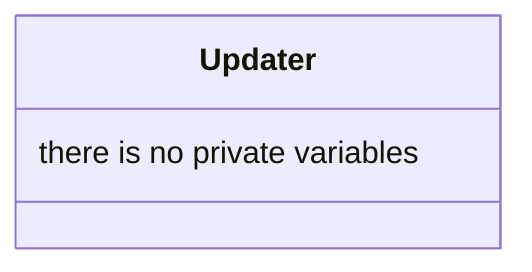

## Updater

The Updater system is one of the fundamental data structures in our ECS. It update all entity who have a possibility of being visible 

| Method | Signature | Description |
| :--- | :--- | :--- |
| **Update** | `void update(const float& dt, World &w)` | Update the collider and the sprite `w` |

