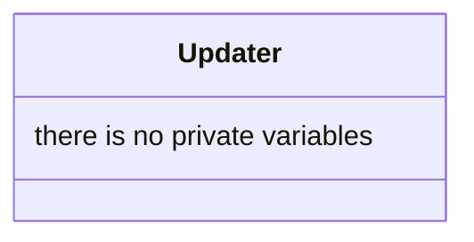

## Updater

The Updater system is one of the fundamental data structures in our ECS. It update all entity who have a possibility of being visible 

| Method | Signature | Description |
|:---|:---|:---|
| **Constructor** | `Updater()` | Constructs the Updater system. |
| **Destructor** | `~Updater()` | Destroys the Updater system. |
| **Update** | `void update(const float& dt, World &w)` | The main update loop. It synchronizes Sprites, Cameras, Animations, and BoxColliders with the world state and delta time. |

