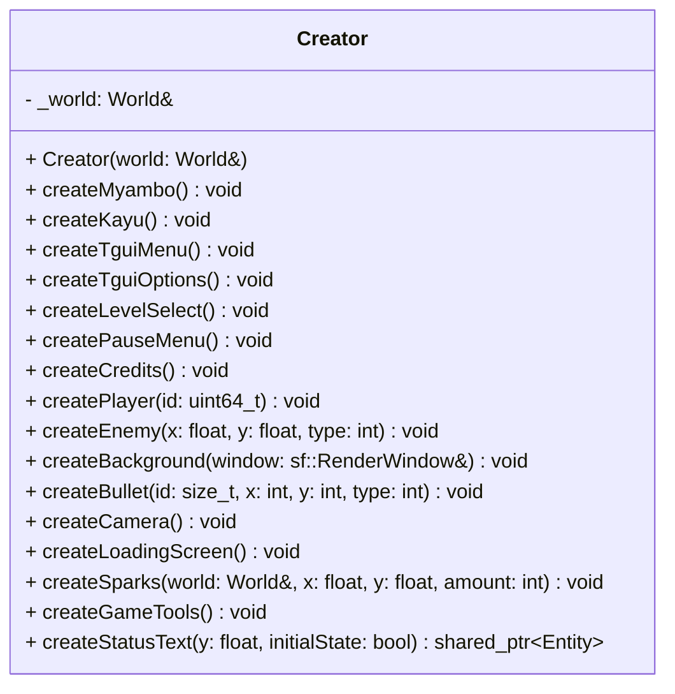

## Creator

The **Creator** class acts as an **Entity Factory**.  
It centralizes the logic for instantiating complex entities (Players, Enemies, UI elements, Splash screens) by assembling the necessary components. It handles the transition between hardcoded data and the ECS World, ensuring consistent entity initialization.

### Dependencies & Integration

| Type | Name | Description |
|:---|:---|:---|
| **Context** | [`World`](../World.md) | Holds a reference to the World to create entities and add components. |
| **UI Library** | `TGUI` | Used within `createTguiMenu` and `createTguiOptions` to build interactive interfaces. |
| **Logic** | [`ScriptsHandler`](../../Client/ScriptsHandler.md) | Attaches standalone logic functions to entities via the `Script` component. |

---

### Public Methods

#### Splash Screens & Logos
| Method | Signature | Description |
|:---|:---|:---|
| **Create Myambo** | `void createMyambo()` | Initializes the "Myambo Studios" splash screen (Scene 10) with text effects and sound. |
| **Create Kayu** | `void createKayu()` | Initializes the "Kayu Corp" animated logo (Scene 11) using an exponential "slam" effect. |

#### Menus & UI (TGUI)
| Method | Signature | Description |
|:---|:---|:---|
| **Create Tgui Menu** | `void createTguiMenu()` | Builds the Main Menu (Scene 2) using TGUI widgets (Start, Options, Exit). |
| **Create Tgui Options**| `void createTguiOptions()` | Builds the scrollable Options menu (Scene 3) with toggles and sliders. |
| **Create Level Select**| `void createLevelSelect()` | (Placeholder) Initializes the level selection interface. |
| **Create Pause Menu** | `void createPauseMenu()` | (Placeholder) Initializes the in-game pause overlay. |
| **Create Credits** | `void createCredits()` | Creates a long scrolling credits sequence (Scene 42) using pure ECS Text and Velocity. |

#### Gameplay Entities
| Method | Signature | Description |
|:---|:---|:---|
| **Create Player** | `void createPlayer(uint64_t id = 0)` | Spawns a player spaceship with health, mana bars, thruster effects, and networking ID. |
| **Create Enemy** | `void createEnemy(float x, float y, int type)` | Spawns an enemy entity at coordinates `(x, y)` based on a specific `EnemyType`. |
| **Create Bullet** | `void createBullet(size_t id, int x, int y, int type)` | Spawns a projectile entity originating from the specified location. |
| **Create Background** | `void createBackground(sf::RenderWindow& win)` | Spawns seamless parallax background entities scaled to the window size. |
| **Create Camera** | `void createCamera()` | Initializes the primary camera entity for the World. |

#### Utilities & Internal Tools
| Method | Signature | Description |
|:---|:---|:---|
| **Create Loading** | `void createLoadingScreen()` | Initializes Scene 0 entities (Progress bar, status text). |
| **Create Game Tools** | `void createGameTools()` | Spawns hidden data entities to store global settings (Volume, Difficulty, Accessibility). |
| **Create Sparks** | `void createSparks(World &w, float x, float y, int amt)` | Generates a burst of particle entities with random velocities for impact effects. |
| **Create Status Text**| `shared_ptr~Entity~ createStatusText(float y, bool state)` | Helper to create a UI text element indicating an "ON/OFF" state. |

---

### Internal Data

