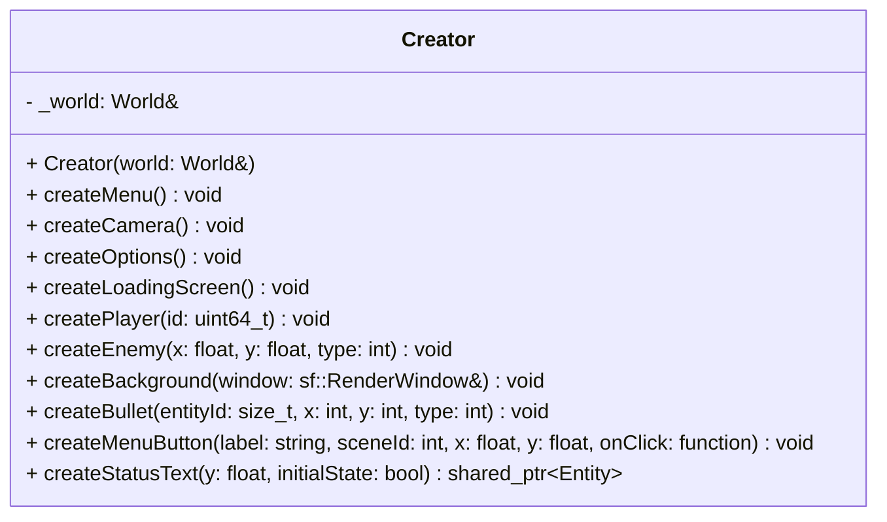

## Creator

The **Creator** class acts as an **Entity Factory**.  
It centralizes the logic for instantiating complex entities (like Players, Enemies, or UI elements) by assembling the necessary components. This keeps the main `Game` class clean and ensures consistent entity initialization across the application.

### Dependencies & Integration

This class operates directly on the **World** to populate it.

| Type | Name | Description |
|:---|:---|:---|
| **Context** | [`World`](../World.md) | The Creator holds a reference to the World instance to call `createEntity()` and `addComponent()`. |
| **Components** | *All* | The implementation of this class relies on almost every component to build functional game objects. |

---

### Public Methods

| Method | Signature | Description |
|:------|:----------|:------------|
| **Create Menu** | `void createMenu();` | Initializes the entities required for the Main Menu scene (title, buttons). |
| **Create Options** | `void createOptions();` | Initializes the entities for the Options scene. |
| **Create Loading** | `void createLoadingScreen();` | Initializes the entities for the Loading scene. |
| **Create Camera** | `void createCamera();` | Spawns the main camera entity used for the game view. |
| **Create Background**| `void createBackground(sf::RenderWindow& window);` | Spawns the scrolling background, scaled to fit the provided window dimensions. |
| **Create Player** | `void createPlayer(uint64_t id = 0);` | Spawns a player ship. Uses a specific ID if provided (useful for networking), otherwise generates a new one. |
| **Create Enemy** | `void createEnemy(float x, float y, int type);` | Spawns an enemy entity at the specified coordinates based on the enemy type. |
| **Create Bullet** | `void createBullet(size_t entityId, int x, int y, int type);` | Spawns a projectile originating from `(x, y)` relative to the source `entityId`. |
| **Create Button** | `void createMenuButton(const std::string& label, int sceneId, float x, float y, const std::function<void()>& onClick);` | Helper to create a generic UI button with a specific label, scene context, position, and callback function. |
| **Create Text** | `std::shared_ptr<Entity> createStatusText(float y, bool initialState);` | Helper to create a specific status text element (e.g., for connection status). |

---

### Constructor

| Constructor | Signature | Description |
|:------------|:----------|:------------|
| **Creator** | `Creator(World& world);` | Initializes the factory with a reference to the active ECS World. |

---

### Internal Data

