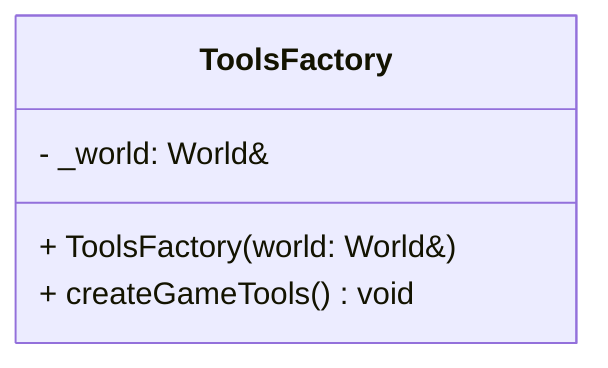

# ToolsFactory

The **ToolsFactory** is a specialized sub-factory responsible for creating non-visual, "meta-entities" that store global game settings and persistent data. These entities act as a decentralized global state using the ECS **Data** and **Tag** components.

## Integration

This factory is used by the main [**Factory**](Factory.md) during the initialization phase (usually at the start of the application or during the loading screen).

| Type | Name | Description |
|:---|:---|:---|
| **Context** | [`World`](../../ECS/World.md) | A reference to the ECS World where the setting entities are stored. |
| **Storage** | [`Data`](../../ECS/Component/Data.md) | The primary component used to store key-value pairs (settings, scores, etc.). |
| **Identifier** | [`Tag`](../../ECS/Component/Tag.md) | Used to retrieve these specific entities via `GameHelper`. |

---

## Public Methods

| Method | Signature | Description |
|:---|:---|:---|
| **Create Game Tools** | `void createGameTools()` | Spawns all the global configuration and tracking entities. |

---

## Managed Data Entities

When `createGameTools()` is called, it initializes the following entities:

### 1. Game Statistics (`game_stats`)
Tracks the player's performance during the session.
*   **Keys**: `score`, `last_score`, `high_score`, `color_timer`.

### 2. Volume Settings (`game_volume_settings`)
Handles audio configuration.
*   **Keys**: `music_volume`, `sfx_volume`, `master_volume`.
*   **Logic**: Includes a `Script` to react to volume changes.

### 3. Difficulty Settings (`game_difficulty_settings`)
Toggles gameplay modifiers.
*   **Keys**: `is_easy_mode`, `is_hard_mode`, `is_god_mode`.

### 4. Availability / Accessibility (`game_availability_settings`)
Handles accessibility options and localization.
*   **Keys**: `is_color_blind`, `disclexia_mode` (Dyslexia font), `language`, `lastfont_used`.
*   **Logic**: Includes a `Script` to apply font or color filter changes globally.

### 5. Controls (`game_controls_settings`)
Stores the keybindings for the player.
*   **Keys**: `UP`, `DOWN`, `LEFT`, `RIGHT`, `SHOOT`.

---

## Internal Structure

These entities are usually persistent or assigned to the `LOADING` scene to ensure they are available as soon as the game starts.

