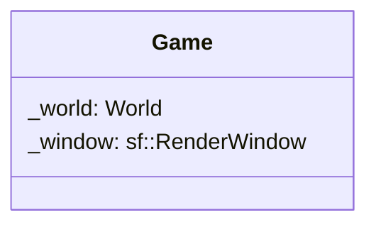

## Game

The **Game** class is the central controller of the client-side application. It is responsible for initializing the window, managing the ECS (Entity Component System) World, handling user inputs, and executing the main game loop.

| Method | Signature | Description |
|:---|:---|:---|
| **Constructor** | `Game(unsigned int width, unsigned int height, const std::string& title)` | Initializes the game window with specific dimensions and title, and sets up the ECS World. |
| **Destructor** | `~Game()` | Cleans up resources, closes the window, and destroys the game instance. |
| **Run** | `void run()` | Starts the main game loop. This method handles event polling, system updates, and rendering. |
| **Game Input** | `void gameInput(std::shared_ptr<Inputs> inputSystem)` | Processes global game inputs (e.g., pausing, quitting the game via Escape or window close event). |
| **Player Input** | `void playerInput(std::shared_ptr<Inputs> inputSystem)` | Processes inputs specific to the player entity (movement, shooting/actions). |
| **Create Player** | `void createPlayer()` | Instantiates the player entity, assigning it necessary components like Position, Sprite, and HP. |
| **Create Laser** | `void createLaser(int entityId)` | Creates a laser/projectile entity starting from the position of the entity with the given `entityId`. |
| **Laser Movement**| `void laserMovement()` | Updates the position of all active lasers and handles memory management by destroying lasers that go off-screen. |

