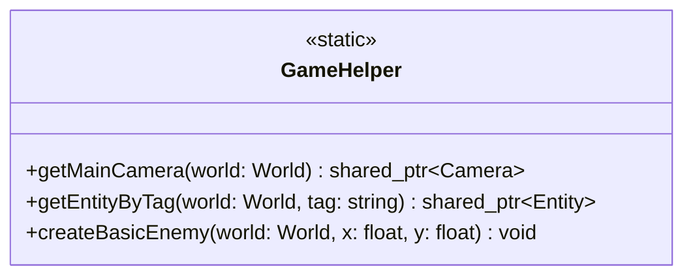

## GameHelper

The **GameHelper** class is a static utility class designed to assist the main game logic. It provides helper functions to retrieve specific components or entities (like the main camera) and to streamline entity creation (like spawning enemies), keeping the main `Game` class clean.

| Method | Signature | Description |
|:---|:---|:---|
| **Get Main Camera** | `static std::shared_ptr<Camera> getMainCamera(World &world)` | Retrieves the primary camera component from the world by searching for the "main_camera" tag. |
| **Get Entity By Tag** | `static std::shared_ptr<Entity> getEntityByTag(World &world, const std::string &tag)` | specific entity by its tag string. Returns `nullptr` if not found. |
| **Create Basic Enemy**| `static void createBasicEnemy(World &world, float x, float y)` | Spawns a standard enemy entity at the specified `(x, y)` coordinates with default components. |

